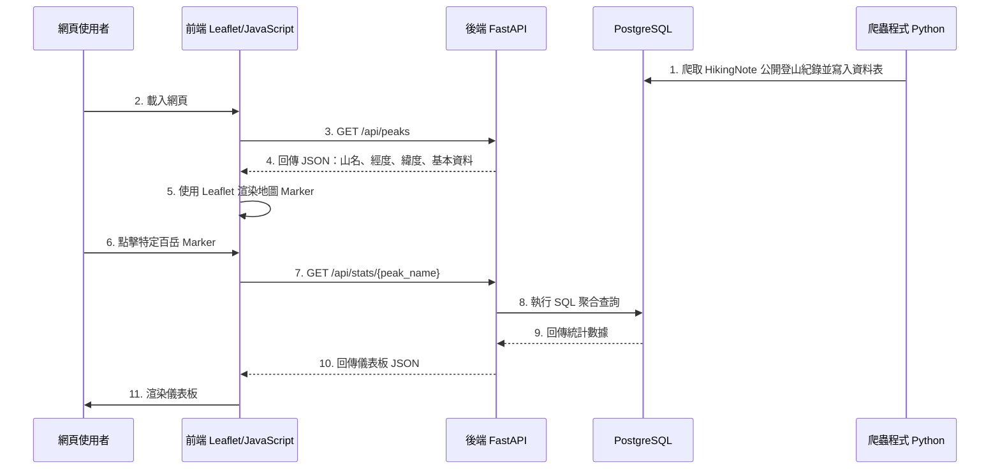

# Taiwan 100 Peaks One-Day Hike Dashboard

## 0. 文件用途

本文件提供給 Codex 或其他 AI Coding Agent 作為專案上下文資訊文件使用。

AI 在協助開發本專案時，應優先遵守本文件描述的：

- 專案目標
- MVP 範圍
- 技術堆疊
- 系統架構
- 資料庫設計
- API 需求
- 開發順序
- 不應主動實作的功能
- Git 與 Docker 開發規範

除非使用者明確要求，請不要自行擴充超出 MVP 的功能。

---

## 1. 專案一句話目標

讓想挑戰臺灣百岳單攻的人，能透過地圖快速比較各山岳的單攻難度、熱門月份與平均耗時，作為行前規劃參考。

---

## 2. 專案概述

### 2.1 專案名稱

臺灣百岳單攻視覺化地圖  
Taiwan 100 Peaks One-Day Hike Dashboard

### 2.2 核心目標

透過地圖視覺化，提供可單攻百岳的難度評估與歷史登山紀錄分析。

MVP 階段的核心體驗是：

1. 使用者打開網站後，可以看到臺灣地圖。
2. 地圖上會標示至少 5 座可單攻百岳。
3. 使用者點擊山岳 Marker 後，可以看到該山的基本資訊與統計資料。
4. 統計資料至少包含：
   - 平均耗時
   - 一到十二月登山比例
   - 距離
   - 海拔
   - 海拔落差

---

## 3. 技術堆疊

### 3.1 Frontend

- HTML
- CSS
- JavaScript
- Leaflet.js
- Chart.js

用途：

- Leaflet.js：顯示臺灣地圖與山岳 Marker
- Chart.js：顯示儀表板圖表，例如月份分布圖

### 3.2 Backend

- Python
- FastAPI

用途：

- 提供 RESTful API
- 回傳山岳資料
- 回傳特定山岳的統計資料
- 與 PostgreSQL 資料庫連線

### 3.3 Database

- PostgreSQL

用途：

- 儲存山岳基本資料
- 儲存 HikingNote 公開登山紀錄資料
- 提供後端 API 查詢與聚合統計

### 3.4 Crawler and Data Processing

- Python
- Requests
- BeautifulSoup
- Pandas

用途：

- 蒐集 HikingNote 公開登山紀錄
- 整理登山日期、登山距離、登山總耗時等欄位
- 清洗資料格式
- 寫入 PostgreSQL

MVP 階段爬蟲可以先採手動執行，不一定要加入自動排程。

---

## 4. Docker 開發環境

本專案使用 Docker 建立獨立的容器式開發環境，降低環境安裝差異，確保前端、後端、資料庫與資料處理流程可以被穩定重現。

### 4.1 建議使用 Docker Compose 管理服務

建議服務如下：

| Service | 說明 |
| --- | --- |
| frontend | 前端地圖與儀表板介面 |
| backend | FastAPI API 服務 |
| db | PostgreSQL 資料庫 |
| crawler | 登山紀錄爬蟲與資料清洗程式 |

### 4.2 MVP 階段 Docker 驗收條件

MVP 階段至少需完成：

1. 可以使用 Docker Compose 一次啟動前端、後端與資料庫。
2. 後端服務可以成功連線 PostgreSQL。
3. 前端可以透過 API 取得資料並顯示在地圖上。
4. 爬蟲程式可以在容器中執行，並將資料寫入資料庫。

### 4.3 建議目錄結構

```text
taiwan-100-peaks-dashboard/
├── frontend/
│   ├── index.html
│   ├── css/
│   │   └── style.css
│   └── js/
│       ├── app.js
│       ├── map.js
│       └── dashboard.js
├── backend/
│   ├── app/
│   │   ├── main.py
│   │   ├── database.py
│   │   ├── models.py
│   │   ├── schemas.py
│   │   └── routers/
│   │       ├── peaks.py
│   │       └── stats.py
│   ├── pyproject.toml
│   ├── uv.lock
│   ├── requirements.txt
│   └── Dockerfile
├── crawler/
│   ├── pyproject.toml
│   ├── uv.lock
│   ├── crawler.py
│   ├── transform.py
│   ├── load.py
│   ├── requirements.txt
│   └── Dockerfile
├── db/
│   ├── init.sql
│   └── seed.sql
├── docker-compose.yml
├── .env.example
├── .gitignore
└── PROJECT_CONTEXT.md
```

---

## 5. 版本控制規範

本專案使用 Git 進行版本控制，確保每個功能完成後都能留下可追蹤的開發紀錄。

### 5.1 Commit 原則

1. 每完成一個小功能即建立一次 commit。
2. Commit 訊息需清楚描述本次完成內容。
3. 若使用 AI 工具協助開發，每次要求 AI 修改程式前，需先確認目前版本已 commit。
4. 若 AI 修改後造成錯誤，應透過 Git 回復到上一個穩定版本。

### 5.2 建議 Git Tag

重要階段需建立 Git tag，例如：

```text
v0.1-map-prototype
v0.2-database-api
v0.3-crawler-import
v0.4-dashboard
v1.0-mvp
```

### 5.3 建議分支

```text
main                穩定版本
develop             整合開發版本
feature/map         地圖功能
feature/api         後端 API
feature/crawler     爬蟲功能
feature/dashboard   儀表板功能
feature/docker      容器化環境
```

---

## 6. 資料庫設計

本專案以 PostgreSQL 作為資料庫。

MVP 階段建議至少建立兩張資料表：

1. `mountains`
2. `hike_records`

---

### 6.1 `mountains`

此資料表儲存百岳基本資料。每一列代表一座山岳。

| 欄位名稱 | 資料型態 | 說明 |
| --- | --- | --- |
| `mountain_id` | SERIAL PRIMARY KEY | 山岳唯一識別碼 |
| `peak_name` | VARCHAR(100) NOT NULL UNIQUE | 百岳名稱，例如：玉山主峰 |
| `latitude` | NUMERIC(10, 7) NOT NULL | 緯度 |
| `longitude` | NUMERIC(10, 7) NOT NULL | 經度 |
| `elevation_m` | INTEGER | 海拔高度，單位：公尺 |
| `elevation_diff_m` | INTEGER | 海拔落差，單位：公尺 |
| `distance_km` | NUMERIC(6, 2) | 常見單攻路線距離，單位：公里 |
| `image_url` | TEXT | 山岳代表圖片 URL，可先為空 |
| `description` | TEXT | 山岳簡介，可先為空 |

---

### 6.2 `hike_records`

此資料表儲存爬蟲抓取到的登山紀錄。每一列代表一筆獨立登山紀錄。

| 欄位名稱 | 資料型態 | 說明 |
| --- | --- | --- |
| `record_id` | SERIAL PRIMARY KEY | 紀錄唯一識別碼 |
| `mountain_id` | INTEGER REFERENCES mountains(mountain_id) | 對應的山岳 ID |
| `peak_name` | VARCHAR(100) NOT NULL | 百岳名稱，保留文字欄位方便比對與除錯 |
| `hike_date` | DATE | 登山日期 |
| `distance_km` | NUMERIC(6, 2) | 總水平距離，單位：公里 |
| `duration_mins` | INTEGER | 總耗時，單位：分鐘 |
| `elevation_diff_m` | INTEGER | 海拔落差，單位：公尺 |
| `source_url` | TEXT | 原始登山紀錄網址 |
| `created_at` | TIMESTAMP DEFAULT CURRENT_TIMESTAMP | 資料建立時間 |

---

### 6.3 MVP 測試資料要求

MVP 階段資料量至少需符合以下其中一項：

1. PostgreSQL 中至少儲存 100 筆登山紀錄資料。
2. 每座 MVP 山岳至少有 10 筆登山紀錄資料。

---

## 7. 系統架構與資料流



---

## 8. API 設計

### 8.1 `GET /api/peaks`

取得 MVP 階段所有可顯示於地圖上的山岳資料。

#### Response 範例

```json
[
  {
    "peak_name": "玉山主峰",
    "latitude": 23.4700,
    "longitude": 120.9573,
    "elevation_m": 3952,
    "elevation_diff_m": 1350,
    "distance_km": 21.8,
    "image_url": null
  }
]
```

---

### 8.2 `GET /api/stats/{peak_name}`

取得指定山岳的統計資料。

#### Response 範例

```json
{
  "peak_name": "玉山主峰",
  "record_count": 25,
  "average_duration_mins": 720,
  "average_duration_text": "12 小時 0 分",
  "distance_km": 21.8,
  "elevation_m": 3952,
  "elevation_diff_m": 1350,
  "monthly_distribution": [
    { "month": 1, "count": 1, "percentage": 4.0 },
    { "month": 2, "count": 0, "percentage": 0.0 },
    { "month": 3, "count": 2, "percentage": 8.0 },
    { "month": 4, "count": 3, "percentage": 12.0 },
    { "month": 5, "count": 4, "percentage": 16.0 },
    { "month": 6, "count": 3, "percentage": 12.0 },
    { "month": 7, "count": 5, "percentage": 20.0 },
    { "month": 8, "count": 4, "percentage": 16.0 },
    { "month": 9, "count": 2, "percentage": 8.0 },
    { "month": 10, "count": 1, "percentage": 4.0 },
    { "month": 11, "count": 0, "percentage": 0.0 },
    { "month": 12, "count": 0, "percentage": 0.0 }
  ],
  "data_status": "ok"
}
```

---

### 8.3 資料不足時的 Response

若該山岳資料不足，前端不應出現錯誤，而是顯示提示文字。

#### Response 範例

```json
{
  "peak_name": "某百岳",
  "record_count": 0,
  "average_duration_mins": null,
  "average_duration_text": "資料不足",
  "monthly_distribution": [],
  "data_status": "insufficient_data",
  "message": "目前此山岳登山紀錄不足，暫時無法產生可靠統計。"
}
```

---

## 9. 儀表板統計邏輯

後端 API 在處理儀表板數據時，需將 `hike_records` 的資料列進行聚合運算。

### 9.1 平均耗時

針對特定 `peak_name`，計算所有紀錄耗時的算術平均數。

```text
Avg Duration = sum(duration_mins) / N
```

其中：

- `N` 為該山岳的總紀錄筆數。
- `duration_mins` 單位為分鐘。
- 若 `N = 0`，不可除以 0，需回傳資料不足狀態。

### 9.2 一到十二月登山比例

提取 `hike_date` 的月份，計算各月份紀錄數佔該山岳總紀錄數的百分比。

```text
Monthly Percentage = count(records in month) / total records of peak * 100
```

### 9.3 月份輸出規則

API 應盡量回傳 1 到 12 月完整資料。

即使某月份沒有紀錄，也應回傳：

```json
{
  "month": 1,
  "count": 0,
  "percentage": 0
}
```

這樣前端 Chart.js 較容易穩定渲染圖表。

---

## 10. MVP 核心功能

MVP 需要完成以下功能：

1. 使用 Leaflet 顯示臺灣地圖。
2. 地圖上至少顯示 5 座可單攻百岳。
3. 山岳座標可以在 MVP 階段先手動建立。
4. 每座山岳 Marker 可以被點擊。
5. 點擊 Marker 後，顯示該山的基本資訊與統計資料。
6. 後端 API 可以查詢 PostgreSQL 並回傳資料。
7. PostgreSQL 中有足夠測試資料。
8. 系統可以根據資料庫紀錄計算平均耗時與月份比例。
9. 若資料不足，系統需顯示提示文字，而不是出現錯誤。

---

## 11. MVP 不包含的功能

以下功能不列入 MVP 第一版。除非使用者明確要求，AI 不應主動實作：

1. 使用者登入與會員系統
2. 使用者收藏山岳
3. 路線導航與即時定位
4. GPX 軌跡播放
5. 天氣預報串接
6. 離線地圖
7. 手機 App
8. 後台管理系統
9. 自動排程爬蟲
10. 所有百岳完整資料
11. 難度評分模型
12. 推薦路線演算法

---

## 12. 第一版開發順序

### Phase 1：靜態地圖原型

目標：先讓使用者看得到地圖與 Marker。

工作項目：

1. 建立 Leaflet 地圖。
2. 手動建立 5 座山岳 JSON 資料。
3. 顯示 Marker。
4. 點擊 Marker 顯示基本資訊。

完成後建議建立 Git tag：

```text
v0.1-map-prototype
```

---

### Phase 2：資料庫與 API 串接

目標：讓地圖資料改由後端 API 與資料庫提供。

工作項目：

1. 建立 PostgreSQL。
2. 建立 `mountains` 與 `hike_records` 資料表。
3. 匯入山岳資料與測試紀錄。
4. 建立 FastAPI 專案。
5. 建立 `GET /api/peaks`。
6. 建立 `GET /api/stats/{peak_name}`。
7. 確認前端可透過 API 取得資料。

完成後建議建立 Git tag：

```text
v0.2-database-api
```

---

### Phase 3：爬蟲與資料整理

目標：能將 HikingNote 公開登山紀錄整理後寫入 PostgreSQL。

工作項目：

1. 撰寫爬蟲取得公開登山紀錄。
2. 清洗登山日期欄位。
3. 清洗距離欄位。
4. 清洗耗時欄位，轉換為分鐘。
5. 寫入 PostgreSQL。
6. 處理資料缺漏與格式不一致問題。
7. 爬蟲可先手動執行，不需排程。

注意事項：

- 爬蟲需尊重網站規範。
- 不應高頻率請求網站。
- 若頁面格式變動，需讓錯誤訊息容易追蹤。
- 原始資料與清洗後資料的轉換邏輯應盡量保留在程式註解或文件中。

完成後建議建立 Git tag：

```text
v0.3-crawler-import
```

---

### Phase 4：儀表板整合

目標：點擊山岳 Marker 後顯示統計儀表板。

工作項目：

1. 點擊 Marker 後呼叫 `GET /api/stats/{peak_name}`。
2. 顯示平均耗時。
3. 顯示月份比例圖。
4. 顯示距離、海拔與海拔落差。
5. 顯示山岳代表圖片。
6. 若資料不足，顯示提示文字。
7. 確保畫面資訊清楚、可讀、可操作。

完成後建議建立 Git tag：

```text
v0.4-dashboard
```

---

### Phase 5：MVP 收斂與驗收

目標：完成一個可展示、可操作、可繼續擴充的 MVP。

工作項目：

1. 使用 Docker Compose 啟動完整服務。
2. 確認前端、後端、資料庫可以互通。
3. 確認至少 5 座山岳可以顯示。
4. 確認至少 100 筆登山紀錄或每座山岳至少 10 筆資料。
5. 確認統計資料可正常顯示。
6. 確認資料不足時不會造成畫面錯誤。
7. 補上 README 的啟動說明。

完成後建議建立 Git tag：

```text
v1.0-mvp
```

---

## 13. MVP 驗收標準

MVP 完成時，需符合以下條件：

1. 使用者可以打開網站並看到臺灣地圖。
2. 地圖上至少顯示 5 座可單攻百岳。
3. 每座山岳 Marker 可以被點擊。
4. 點擊 Marker 後，可以顯示該山的基本資訊與統計資料。
5. PostgreSQL 中至少儲存 100 筆登山紀錄資料，或每座 MVP 山岳至少 10 筆資料。
6. 系統可以根據資料庫紀錄計算平均耗時與月份比例。
7. 畫面不需精美，但資訊需清楚、可讀、可操作。
8. 若資料不足，系統需顯示提示文字，而不是出現錯誤。

---

## 14. 成功指標

MVP 成功不以功能多寡判斷，而是以下列條件判斷：

1. 使用者能在 30 秒內理解這個網站的用途。
2. 使用者能透過點擊地圖查看山岳統計資訊。
3. 使用者能回答：「這座山大約要走多久？哪幾個月份較多人爬？」
4. 開發者能根據 MVP 結果決定下一版是否加入 GPX、天氣、難度評分或使用者收藏功能。

---

## 15. 給 Codex 的開發守則

### 15.1 修改程式前

在修改程式前，請先確認：

1. 目前工作樹是否乾淨。
2. 目前是否已有 Git commit。
3. 本次修改是否符合 MVP 範圍。
4. 本次修改是否只處理一個明確的小功能。

### 15.2 修改程式時

請遵守：

1. 優先做最小可行修改。
2. 不要一次重構過多檔案。
3. 不要主動加入 MVP 以外功能。
4. 不要把 API key、密碼、資料庫密碼寫死在程式中。
5. 使用 `.env` 或 Docker Compose environment 管理環境變數。
6. 若新增資料表或欄位，需同步更新 SQL 與文件。
7. 若新增 API，需提供 request/response 範例。
8. 若修改前端資料格式，需同步確認後端 response 是否一致。

### 15.3 修改程式後

每次修改後，請協助檢查：

1. Docker Compose 是否可正常啟動。
2. Backend 是否可連線 PostgreSQL。
3. Frontend 是否可呼叫 API。
4. Marker 是否可正常顯示。
5. Dashboard 是否可正常渲染。
6. 資料不足情境是否不會報錯。
7. 是否需要新增或更新 README 說明。

### 15.4 建議 Commit Message 格式

```text
feat: add leaflet map prototype
feat: add peaks api
feat: add postgres schema
feat: add hiking record crawler
feat: add dashboard monthly chart
fix: handle insufficient hiking records
docs: update project setup guide
chore: add docker compose services
```

---

## 16. 建議優先建立的檔案

若專案尚未建立，建議依序建立：

1. `README.md`
2. `PROJECT_CONTEXT.md`
3. `.gitignore`
4. `.env.example`
5. `docker-compose.yml`
6. `frontend/index.html`
7. `frontend/css/style.css`
8. `frontend/js/app.js`
9. `backend/requirements.txt`
10. `backend/app/main.py`
11. `backend/app/database.py`
12. `backend/app/routers/peaks.py`
13. `backend/app/routers/stats.py`
14. `db/init.sql`
15. `db/seed.sql`
16. `crawler/crawler.py`

---

## 17. 開發優先順序摘要

最優先：

1. 地圖能顯示。
2. Marker 能點擊。
3. API 能回資料。
4. 資料庫能儲存資料。
5. Dashboard 能顯示平均耗時與月份比例。

暫時不要做：

1. 登入系統。
2. 收藏功能。
3. GPX。
4. 天氣。
5. 手機 App。
6. 自動排程。
7. 完整百岳資料庫。

---

本專案 Python 環境統一使用 uv 管理。

規則如下：

1. backend 與 crawler 皆需使用各自的 pyproject.toml 管理 Python dependencies。
2. 使用 uv.lock 鎖定套件版本，確保不同開發環境可重現。
3. 不要直接使用全域 pip install 安裝套件。
4. 不要將 .venv/ 提交到 Git。
5. 新增 Python 套件時，必須使用 uv add。
6. 執行 Python 程式時，優先使用 uv run。
7. 若修改 Python dependencies，必須同步提交 pyproject.toml 與 uv.lock。
8. Dockerfile 或 docker-compose.yml 需依照 uv 管理方式安裝 dependencies。

---

## 18. 最終目標

本專案第一版不是要做出完整登山平台，而是要做出一個小而穩定的 MVP。

使用者打開網站後，應能快速理解：

- 這是一個臺灣百岳單攻規劃參考工具。
- 可以透過地圖選擇山岳。
- 可以看到該山大約要走多久。
- 可以看到哪些月份較多人挑戰。
- 可以作為下一次登山行前規劃的初步參考。

開發時請優先保持功能清楚、資料流穩定、架構可擴充，而不是追求華麗畫面或過多功能。
