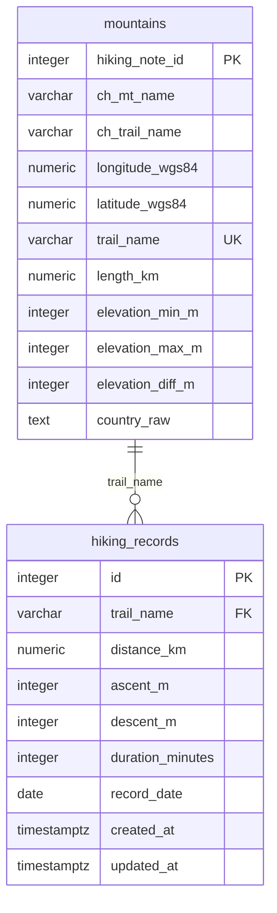

# Taiwan 100 Peaks One-Day Hike Dashboard - Codex Context

## 0. Purpose of This File

This file is the instruction context for Codex or any AI Coding Agent working on this project.

Codex must follow this file before modifying code. The goal is to keep the MVP small, stable, traceable, and aligned with the existing project direction.

Codex must follow:

- MVP scope
- database schema
- API contract
- existing crawler status
- uv dependency management rules
- Git workflow
- Docker development direction
- features that should not be implemented unless explicitly requested

Do not replace the technology stack unless the user explicitly asks.

---

## 1. Project Goal

Build a small MVP web application for Taiwan 100 Peaks one-day hike planning.

Users should be able to:

1. Open a web page and see a Taiwan map.
2. Click a mountain marker.
3. See basic mountain/trail information.
4. See dashboard statistics calculated from HikingNote public hiking records.

Dashboard statistics include:

- average duration
- average distance
- average ascent
- average descent
- monthly record distribution

---

## 2. Current Important Status

The crawler is already written by the user.

Existing crawler file:

```text
crawler/hiking_note_scraper.py
```

The crawler already includes:

- HikingNote AJAX request logic
- BeautifulSoup parsing
- distance parsing
- duration parsing and conversion to minutes
- ascent parsing
- descent parsing
- record date parsing
- multiple trail support
- pagination support

Codex must not rewrite the crawler core logic unless explicitly requested.

Allowed crawler-related tasks:

1. Move crawler into project structure.
2. Manage crawler dependencies with uv.
3. Replace hard-coded cookies with `.env` or environment variables.
4. Add database loading logic only when explicitly requested.
5. Add minimal tests only when explicitly requested.

Security rule:

- Do not commit real cookies, session values, tokens, API keys, or passwords.
- `.env.example` can contain variable names only, not real values.

---

## 3. Technology Stack

### 3.1 Frontend

- HTML
- CSS
- JavaScript
- Leaflet.js
- Chart.js

### 3.2 Backend

- Python
- FastAPI
- SQLAlchemy
- Alembic

### 3.3 Database

- PostgreSQL
- Encoding: UTF-8
- Timezone: Asia/Taipei

### 3.4 Data Source

- HikingNote public hiking records
- Source website: https://hiking.biji.co/trail

### 3.5 Python Dependency Management

Use `uv` strictly.

Rules:

1. `backend` must have its own `pyproject.toml` and `uv.lock`.
2. `crawler` must have its own `pyproject.toml` and `uv.lock`.
3. Do not use global `pip install`.
4. Do not commit `.venv/`.
5. Add dependencies with `uv add`.
6. Run Python scripts with `uv run`.
7. If dependencies change, commit both `pyproject.toml` and `uv.lock`.

---

## 4. Database Rules

Use PostgreSQL with UTF-8 encoding.

Chinese text fields must be stored directly as `VARCHAR` or `TEXT`.

Fields such as the following must keep Chinese values directly:

- `ch_mt_name`
- `ch_trail_name`
- `country_raw`

Do not convert Chinese mountain names or administrative regions into English-only values before storing them.

`country_raw` should preserve the original Chinese text, for example:

```text
臺中市和平區,新竹縣尖石鄉
```

The API may expose `country_raw` as `country`.

---

## 5. Recommended Project Structure

```text
taiwan-100-peaks-dashboard/
├── frontend/
│   ├── index.html
│   ├── css/
│   │   └── style.css
│   └── js/
│       ├── app.js
│       ├── map.js
│       └── dashboard.js
├── backend/
│   ├── app/
│   │   ├── main.py
│   │   ├── database.py
│   │   ├── models.py
│   │   ├── schemas.py
│   │   └── routers/
│   │       ├── mountains.py
│   │       └── dashboard.py
│   ├── alembic/
│   ├── alembic.ini
│   ├── pyproject.toml
│   ├── uv.lock
│   └── Dockerfile
├── crawler/
│   ├── hiking_note_scraper.py
│   ├── pyproject.toml
│   ├── uv.lock
│   └── Dockerfile
├── db/
│   ├── init.sql
│   └── seed.sql
├── docs/
├── docker-compose.yml
├── .env.example
├── .gitignore
└── project_context.md
```

---

## 6. Entity-Relationship Diagram

PK means Primary Key. FK means Foreign Key.



---

## 7. Database Schema

### 7.1 Table: `mountains`

Purpose:

Stores mountain and trail metadata for MVP map markers and API responses.

| Column | Type | Constraint | Description |
| --- | --- | --- | --- |
| `hiking_note_id` | INTEGER | PRIMARY KEY | HikingNote trail ID |
| `ch_mt_name` | VARCHAR(100) | NOT NULL | Chinese mountain group/name |
| `ch_trail_name` | VARCHAR(150) | NOT NULL | Chinese trail name |
| `longitude_wgs84` | NUMERIC(10, 7) |  | WGS84 longitude |
| `latitude_wgs84` | NUMERIC(10, 7) |  | WGS84 latitude |
| `trail_name` | VARCHAR(100) | NOT NULL UNIQUE | English trail key used by crawler and FK |
| `length_km` | NUMERIC(6, 2) | NOT NULL | Route length in kilometers |
| `elevation_min_m` | INTEGER |  | Minimum elevation in meters |
| `elevation_max_m` | INTEGER |  | Maximum elevation in meters |
| `elevation_diff_m` | INTEGER |  | Elevation difference in meters |
| `country_raw` | TEXT |  | Raw Chinese administrative region text |

SQL reference:

```sql
CREATE TABLE mountains (
    hiking_note_id INTEGER PRIMARY KEY,
    ch_mt_name VARCHAR(100) NOT NULL,
    ch_trail_name VARCHAR(150) NOT NULL,
    longitude_wgs84 NUMERIC(10, 7),
    latitude_wgs84 NUMERIC(10, 7),
    trail_name VARCHAR(100) NOT NULL UNIQUE,
    length_km NUMERIC(6, 2) NOT NULL,
    elevation_min_m INTEGER,
    elevation_max_m INTEGER,
    elevation_diff_m INTEGER,
    country_raw TEXT
);
```

### 7.2 Table: `hiking_records`

Purpose:

Stores HikingNote public hiking records. Each row represents one hiking record.

| Column | Type | Constraint | Description |
| --- | --- | --- | --- |
| `id` | INTEGER | PRIMARY KEY | Hiking record ID |
| `trail_name` | VARCHAR(100) | NOT NULL, FK | References `mountains.trail_name` |
| `distance_km` | NUMERIC(6, 2) |  | Distance in kilometers |
| `ascent_m` | INTEGER |  | Ascent in meters |
| `descent_m` | INTEGER |  | Descent in meters |
| `duration_minutes` | INTEGER |  | Duration in minutes |
| `record_date` | DATE |  | Hiking record date |
| `created_at` | TIMESTAMPTZ |  | Created timestamp |
| `updated_at` | TIMESTAMPTZ |  | Updated timestamp |

SQL reference:

```sql
CREATE TABLE hiking_records (
    id INTEGER GENERATED BY DEFAULT AS IDENTITY PRIMARY KEY,
    trail_name VARCHAR(100) NOT NULL REFERENCES mountains(trail_name),
    distance_km NUMERIC(6, 2),
    ascent_m INTEGER,
    descent_m INTEGER,
    duration_minutes INTEGER,
    record_date DATE,
    created_at TIMESTAMPTZ DEFAULT CURRENT_TIMESTAMP,
    updated_at TIMESTAMPTZ DEFAULT CURRENT_TIMESTAMP
);
```

---

## 8. Seed Data

### 8.1 `mountains` seed data

| ch_mt_name | ch_trail_name | longitude_wgs84 | latitude_wgs84 | hiking_note_id | trail_name | length_km | elevation_min_m | elevation_max_m | country_raw | elevation_diff_m |
| --- | --- | ---: | ---: | ---: | --- | ---: | ---: | ---: | --- | ---: |
| 武陵四秀 | 桃山步道 | 121.30463 | 24.43251 | 429 | tao_mountain | 7.9 | 1883 | 3325 | 臺中市和平區,新竹縣尖石鄉 | 1442 |
| 武陵四秀 | 桃山喀拉業 | 121.3213877 | 24.45003069 | 1746 | tao_kalaye | 9 | 1860 | 3325 | 臺中市和平區,新竹縣尖石鄉,宜蘭縣大同鄉 | 1465 |
| 武陵四秀 | 武陵二秀(池有,品田) | 121.2668 | 24.4282 | 1737 | chiyou_pintian | 10.1 | 1860 | 3524 | 臺中市和平區,新竹縣尖石鄉 | 1664 |
| 北大武山 | 北大武山步道 | 120.7613 | 22.62706 | 1750 | mt_beidawu | 12 | 1550 | 3090 | 屏東縣瑪家鄉,屏東縣泰武鄉,臺東縣金峰鄉 | 1540 |
| 塔關山 | 塔關山登山步道 | 120.94119 | 23.2519 | 1761 | mt_taguan | 2.2 | 2580 | 3222 | 高雄市桃源區,臺東縣海端鄉 | 642 |
| 志佳陽大山 | 志佳陽大山登山步道 | 121.25136 | 24.357793 | 531 | mt_hijiayang | 8.3 | 1585 | 3345 | 臺中市和平區 | 1760 |
| 郡大山 | 郡大望鄉登山步道 | 120.96249 | 23.57739 | 500 | mt_junda | 3.7 | 2865 | 3265 | 南投縣信義鄉 | 400 |
| 雪山東峰 | 雪山東峰登山山徑 | 121.272073 | 24.388687 | 1734 | mt_xue_east | 5 | 2140 | 3201 | 臺中市和平區 | 1061 |
| 關山嶺山 | 關山嶺山登山步道 | 120.95943 | 23.27093 | 1760 | mt_guanshangling | 1.5 | 2733 | 3176 | 高雄市桃源區,臺東縣海端鄉 | 443 |
| 合歡山 | 合歡北峰步道 | 121.28167 | 24.18152 | 288 | hehuan_north | 2 | 2975 | 3422 | 南投縣仁愛鄉,花蓮縣秀林鄉 | 447 |
| 合歡山 | 合歡北西步道 | 121.2446 | 24.1777 | 536 | hehuan_north_west | 6.7 | 2975 | 3422 | 南投縣仁愛鄉,花蓮縣秀林鄉 | 447 |
| 玉山 | 玉山前峰登山山徑 | 120.91765 | 23.4756 | 68 | mt_jade_front | 3.5 | 2610 | 3239 | 南投縣信義鄉,嘉義縣阿里山鄉 | 629 |

### 8.2 `hiking_records` sample data

| id | trail_name | distance_km | ascent_m | descent_m | duration_minutes | record_date | created_at | updated_at |
| --- | --- | ---: | ---: | ---: | ---: | --- | --- | --- |
| Example | hehuan_north | 14.69 | 1380 | 1380 | 592 | 2025-10-11 |  |  |

---

## 9. API Contract Related to Database

### 9.1 `GET /api/mountains`

Returns all mountains.

Expected response:

```json
[
  {
    "hiking_note_id": 429,
    "ch_mt_name": "武陵四秀",
    "ch_trail_name": "桃山步道",
    "trail_name": "tao_mountain",
    "latitude": 24.43251,
    "longitude": 121.30463,
    "length_km": 7.9,
    "elevation": 1442,
    "elevation_min_m": 1883,
    "elevation_max_m": 3325,
    "country": "臺中市和平區,新竹縣尖石鄉"
  }
]
```

Mapping:

| API Field | Database Field |
| --- | --- |
| `hiking_note_id` | `mountains.hiking_note_id` |
| `ch_mt_name` | `mountains.ch_mt_name` |
| `ch_trail_name` | `mountains.ch_trail_name` |
| `trail_name` | `mountains.trail_name` |
| `latitude` | `mountains.latitude_wgs84` |
| `longitude` | `mountains.longitude_wgs84` |
| `length_km` | `mountains.length_km` |
| `elevation` | `mountains.elevation_diff_m` |
| `elevation_min_m` | `mountains.elevation_min_m` |
| `elevation_max_m` | `mountains.elevation_max_m` |
| `country` | `mountains.country_raw` |

### 9.2 `GET /api/mountains/{mountain_id}/dashboard`

Returns dashboard statistics for a selected mountain.

Path parameter:

| Parameter | Meaning |
| --- | --- |
| `mountain_id` | Maps to `mountains.hiking_note_id` |

Expected response:

```json
{
  "mountain_id": 288,
  "mountain_name": "合歡北峰步道",
  "trail_name": "hehuan_north",
  "average_duration_minutes": 480,
  "average_distance_km": 10.8,
  "average_ascent_m": 1300,
  "average_descent_m": 1300,
  "monthly_distribution": [
    {
      "month": 1,
      "count": 12
    }
  ],
  "data_status": "ok"
}
```

Insufficient data response:

```json
{
  "mountain_id": 288,
  "mountain_name": "合歡北峰步道",
  "trail_name": "hehuan_north",
  "average_duration_minutes": null,
  "average_distance_km": null,
  "average_ascent_m": null,
  "average_descent_m": null,
  "monthly_distribution": [],
  "data_status": "insufficient_data",
  "message": "目前此山岳登山紀錄不足，暫時無法產生可靠統計。"
}
```

---

## 10. Dashboard Calculation Rules

Dashboard statistics must be calculated from database records.

Do not hard-code dashboard values.

### 10.1 Average Duration

```text
average_duration_minutes = AVG(hiking_records.duration_minutes)
```

### 10.2 Average Distance

```text
average_distance_km = AVG(hiking_records.distance_km)
```

### 10.3 Average Ascent

```text
average_ascent_m = AVG(hiking_records.ascent_m)
```

### 10.4 Average Descent

```text
average_descent_m = AVG(hiking_records.descent_m)
```

### 10.5 Monthly Distribution

```text
monthly_distribution = COUNT(*) GROUP BY EXTRACT(MONTH FROM record_date)
```

Recommended output:

- Return months 1 through 12.
- If a month has no records, return count 0.
- If a mountain has no records, return `data_status = "insufficient_data"`.

---

## 11. Acceptance Criteria

### 11.1 Database

- Create SQLAlchemy models for `mountains` and `hiking_records`.
- Create Alembic migration files.
- Ensure all foreign keys and constraints are correctly implemented.
- `mountains.trail_name` must be unique.
- `hiking_records.trail_name` must reference `mountains.trail_name`.
- Chinese fields such as `ch_mt_name`, `ch_trail_name`, and `country_raw` must be stored directly as `VARCHAR` or `TEXT`.
- PostgreSQL must use UTF-8 encoding.
- Timezone must follow Asia/Taipei.

### 11.2 Seed Data

- Add sample mountain records from this file.
- Add sample hiking records for testing dashboard calculations.
- Include at least one sample record for `hehuan_north`.

### 11.3 API

- `GET /api/mountains` must return all mountain records.
- `GET /api/mountains/{mountain_id}/dashboard` must calculate statistics from database records.
- Dashboard statistics must not be hard-coded.
- Insufficient data must not crash the API or frontend.

---

## 12. Development Workflow for Codex

Before modifying code:

1. Check `git status`.
2. Confirm the current working tree is clean.
3. Confirm the task is within MVP scope.
4. Confirm the task only changes one small feature.
5. Do not rewrite existing crawler logic unless explicitly requested.

When modifying code:

1. Make the smallest viable change.
2. Do not refactor unrelated files.
3. Do not add non-MVP features.
4. Do not hard-code secrets.
5. Use `.env` or Docker Compose environment variables for configuration.
6. If schema changes, create or update Alembic migration files.
7. If API response changes, check frontend usage.
8. If dependencies change, commit `pyproject.toml` and `uv.lock`.

After modifying code:

1. Report changed files.
2. Report whether migration was created or updated.
3. Report whether dependencies changed.
4. Suggest a Git commit message.
5. Suggest test or verification commands.

---

## 13. Git Workflow

### 13.1 Branches

```text
main                stable version
develop             integration branch
feature/project-init
feature/database
feature/api
feature/dashboard
feature/docker
```

### 13.2 Tags

```text
v0.0-project-init
v0.1-map-prototype
v0.2-database-api
v0.3-crawler-import
v0.4-dashboard
v1.0-mvp
```

### 13.3 Commit Message Examples

```text
chore: initialize project structure
chore: initialize backend uv project
chore: manage existing crawler with uv
feat: add sqlalchemy models
feat: add alembic migrations
feat: add mountain seed data
feat: add mountains api
feat: add mountain dashboard api
fix: handle insufficient hiking records
docs: update project context
```

---

## 14. Features Outside MVP

Do not implement the following features unless explicitly requested:

1. User login or membership system.
2. Favorite mountains.
3. Route navigation.
4. Real-time location.
5. GPX playback.
6. Weather API integration.
7. Offline maps.
8. Mobile app.
9. Admin dashboard.
10. Scheduled crawler.
11. Full 100 peaks database.
12. Difficulty scoring model.
13. Recommendation algorithm.

---

## 15. Next Recommended Development Order

1. Preserve existing crawler.
2. Initialize project structure.
3. Initialize backend with uv.
4. Initialize crawler with uv.
5. Add SQLAlchemy models.
6. Add Alembic migrations.
7. Add seed data for `mountains`.
8. Add sample `hiking_records`.
9. Build `GET /api/mountains`.
10. Build `GET /api/mountains/{mountain_id}/dashboard`.
11. Connect frontend map to API.
12. Connect dashboard UI to API.
13. Add Docker Compose integration.

Keep the MVP small and stable. Do not build a full hiking platform in the first version.
