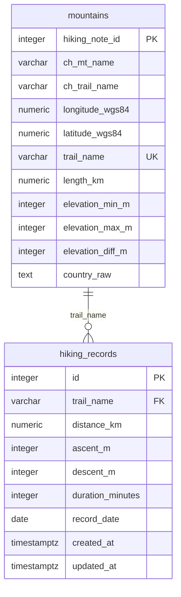

# 臺灣百岳單攻互動式地圖網站 Project Context

## 0. 文件用途

本文件提供給 Codex 或其他 AI Coding Agent 作為專案上下文資訊文件使用。

AI 在協助開發本專案時，應優先遵守本文件描述的：

- 專案目標
- MVP 範圍
- 技術堆疊
- 資料庫設計
- API Contract
- Python 套件管理規則
- Docker 與 Git 開發規範
- 不應主動實作的功能

除非使用者明確要求，AI 不應主動更換技術棧，也不應擴充超出 MVP 範圍的功能。

---

## 1. 專案一句話說明

本專案是一個以 Leaflet 呈現臺灣百岳單攻路線資料的互動式地圖網站，使用者點擊山岳後，可查看該山的登山統計儀表板，例如平均耗時、平均距離、平均爬升、平均下降與月份分布。

---

## 2. MVP 目標

MVP 階段目標是建立一個小而穩定的臺灣百岳單攻資料視覺化網站。

MVP 階段需完成：

1. 使用 Leaflet 顯示臺灣地圖。
2. 在地圖上標示至少 5 座可單攻百岳。
3. 使用者點擊 Marker 後，可以查看山岳基本資訊。
4. 後端 FastAPI 可以從 PostgreSQL 取得山岳資料。
5. 後端可以從 `hiking_records` 計算儀表板統計資料。
6. 前端可以顯示平均耗時、平均距離、平均爬升、平均下降與月份分布。
7. 資料不足時，前端應顯示提示文字，而不是發生錯誤。

---

## 3. 技術堆疊

### 3.1 Frontend

- HTML
- CSS
- JavaScript
- Leaflet.js
- Chart.js

用途：

- `Leaflet.js`：呈現臺灣地圖與山岳 Marker。
- `Chart.js`：呈現山岳統計儀表板圖表，例如一到十二月登山紀錄分布。

### 3.2 Backend

- Python
- FastAPI
- SQLAlchemy
- Alembic

用途：

- 提供 RESTful API。
- 回傳山岳基本資料。
- 回傳指定山岳的儀表板統計資料。
- 使用 SQLAlchemy ORM 與 PostgreSQL 連線。
- 使用 Alembic 管理資料庫 schema migration。

### 3.3 Database Technology

- Database：PostgreSQL
- Encoding：UTF-8
- Timezone：Asia/Taipei
- ORM：SQLAlchemy
- Migration Tool：Alembic
- Data Source：HikingNote 公開登山紀錄（https://hiking.biji.co/trail）

資料庫規則：

1. PostgreSQL 資料庫需使用 UTF-8 編碼。
2. `ch_mt_name`、`ch_trail_name`、`country_raw` 等中文資料直接以 `VARCHAR` 或 `TEXT` 儲存。
3. 不需要將中文欄位轉為英文代碼後才儲存。
4. `country_raw` 用來保留原始行政區文字，例如：`臺中市和平區,新竹縣尖石鄉`。
5. API 對外輸出時可以將 `country_raw` 命名為 `country`。

### 3.4 Crawler and Data Processing

- Python
- Requests
- BeautifulSoup
- lxml
- Pandas（後續清洗與資料匯入時使用）

目前狀態：

- 使用者已完成 `hiking_note_scraper.py`。
- 該爬蟲已可透過 HikingNote AJAX 端點取得軌跡紀錄。
- 該爬蟲已包含距離、耗時、爬升、下降與紀錄日期解析。
- Codex 不應重寫爬蟲核心邏輯。
- 若需要調整，只能做最小修改，例如改為讀取 `.env`、整理輸出格式、串接資料庫寫入。

安全規則：

1. 不要將真實 Cookie、Session、API key 或密碼提交到 Git。
2. 爬蟲所需 Cookie 應改由 `.env` 或環境變數提供。
3. `.env.example` 可以提供欄位名稱，但不可包含真實值。
4. 爬蟲需尊重網站使用規範，不應高頻率請求網站。

### 3.5 Python 套件管理

本專案 Python 環境統一使用 `uv` 管理。

規則如下：

1. `backend` 與 `crawler` 皆需使用各自的 `pyproject.toml` 管理 Python dependencies。
2. 使用 `uv.lock` 鎖定套件版本，確保不同開發環境可重現。
3. 不要直接使用全域 `pip install` 安裝套件。
4. 不要將 `.venv/` 提交到 Git。
5. 新增 Python 套件時，必須使用 `uv add`。
6. 執行 Python 程式時，優先使用 `uv run`。
7. 若修改 Python dependencies，必須同步提交 `pyproject.toml` 與 `uv.lock`。
8. Dockerfile 或 `docker-compose.yml` 後續需依照 uv 管理方式安裝 dependencies。

---

## 4. 建議專案目錄結構

```text
taiwan-100-peaks-dashboard/
├── frontend/
│   ├── index.html
│   ├── css/
│   │   └── style.css
│   └── js/
│       ├── app.js
│       ├── map.js
│       └── dashboard.js
├── backend/
│   ├── app/
│   │   ├── main.py
│   │   ├── database.py
│   │   ├── models.py
│   │   ├── schemas.py
│   │   └── routers/
│   │       ├── mountains.py
│   │       └── dashboard.py
│   ├── alembic/
│   ├── alembic.ini
│   ├── pyproject.toml
│   ├── uv.lock
│   └── Dockerfile
├── crawler/
│   ├── hiking_note_scraper.py
│   ├── pyproject.toml
│   ├── uv.lock
│   └── Dockerfile
├── db/
│   ├── init.sql
│   └── seed.sql
├── docs/
├── docker-compose.yml
├── .env.example
├── .gitignore
└── project_context.md
```

---

## 5. Entity-Relationship Diagram

PK 代表 Primary Key，FK 代表 Foreign Key。



---

## 6. Database Schema Design

### 6.1 Table：`mountains`

用途：儲存可單攻百岳路線基本資料。每一列代表一條可視覺化的百岳路線。

> 注意：使用者提供的欄位 `country` 在資料庫中建議命名為 `country_raw`，用來保留原始中文行政區文字。API 回傳時可以輸出為 `country`。

| 欄位名稱 | 資料型態 | 限制 | 說明 |
| --- | --- | --- | --- |
| `hiking_note_id` | INTEGER | PRIMARY KEY | HikingNote 對應路線 ID |
| `ch_mt_name` | VARCHAR(100) | NOT NULL | 中文山系或山名，例如：武陵四秀 |
| `ch_trail_name` | VARCHAR(150) | NOT NULL | 中文路線名稱，例如：桃山步道 |
| `longitude_wgs84` | NUMERIC(10, 7) |  | WGS84 經度 |
| `latitude_wgs84` | NUMERIC(10, 7) |  | WGS84 緯度 |
| `trail_name` | VARCHAR(100) | NOT NULL UNIQUE | 英文路線識別碼，供爬蟲資料與 FK 對應 |
| `length_km` | NUMERIC(6, 2) | NOT NULL | 路線長度，單位：公里 |
| `elevation_min_m` | INTEGER |  | 最低海拔，單位：公尺 |
| `elevation_max_m` | INTEGER |  | 最高海拔，單位：公尺 |
| `elevation_diff_m` | INTEGER |  | 海拔落差，單位：公尺 |
| `country_raw` | TEXT |  | 原始中文行政區文字 |

SQL 建議：

```sql
CREATE TABLE mountains (
    hiking_note_id INTEGER PRIMARY KEY,
    ch_mt_name VARCHAR(100) NOT NULL,
    ch_trail_name VARCHAR(150) NOT NULL,
    longitude_wgs84 NUMERIC(10, 7),
    latitude_wgs84 NUMERIC(10, 7),
    trail_name VARCHAR(100) NOT NULL UNIQUE,
    length_km NUMERIC(6, 2) NOT NULL,
    elevation_min_m INTEGER,
    elevation_max_m INTEGER,
    elevation_diff_m INTEGER,
    country_raw TEXT
);
```

### 6.2 Table：`hiking_records`

用途：儲存 HikingNote 公開登山紀錄。每一列代表一筆獨立登山紀錄。

| 欄位名稱 | 資料型態 | 限制 | 說明 |
| --- | --- | --- | --- |
| `id` | INTEGER | PRIMARY KEY | 登山紀錄唯一識別碼 |
| `trail_name` | VARCHAR(100) | NOT NULL, FK | 對應 `mountains.trail_name` |
| `distance_km` | NUMERIC(6, 2) |  | 實際紀錄距離，單位：公里 |
| `ascent_m` | INTEGER |  | 爬升高度，單位：公尺 |
| `descent_m` | INTEGER |  | 下降高度，單位：公尺 |
| `duration_minutes` | INTEGER |  | 總耗時，單位：分鐘 |
| `record_date` | DATE |  | 登山紀錄日期 |
| `created_at` | TIMESTAMPTZ |  | 資料建立時間 |
| `updated_at` | TIMESTAMPTZ |  | 資料更新時間 |

SQL 建議：

```sql
CREATE TABLE hiking_records (
    id INTEGER GENERATED BY DEFAULT AS IDENTITY PRIMARY KEY,
    trail_name VARCHAR(100) NOT NULL REFERENCES mountains(trail_name),
    distance_km NUMERIC(6, 2),
    ascent_m INTEGER,
    descent_m INTEGER,
    duration_minutes INTEGER,
    record_date DATE,
    created_at TIMESTAMPTZ DEFAULT CURRENT_TIMESTAMP,
    updated_at TIMESTAMPTZ DEFAULT CURRENT_TIMESTAMP
);
```

---

## 7. Seed Data

### 7.1 `mountains` sample data

| ch_mt_name | ch_trail_name | longitude_wgs84 | latitude_wgs84 | hiking_note_id | trail_name | length_km | elevation_min_m | elevation_max_m | country_raw | elevation_diff_m |
| --- | --- | ---: | ---: | ---: | --- | ---: | ---: | ---: | --- | ---: |
| 武陵四秀 | 桃山步道 | 121.30463 | 24.43251 | 429 | tao_mountain | 7.9 | 1883 | 3325 | 臺中市和平區,新竹縣尖石鄉 | 1442 |
| 武陵四秀 | 桃山喀拉業 | 121.3213877 | 24.45003069 | 1746 | tao_kalaye | 9 | 1860 | 3325 | 臺中市和平區,新竹縣尖石鄉,宜蘭縣大同鄉 | 1465 |
| 武陵四秀 | 武陵二秀(池有,品田) | 121.2668 | 24.4282 | 1737 | chiyou_pintian | 10.1 | 1860 | 3524 | 臺中市和平區,新竹縣尖石鄉 | 1664 |
| 北大武山 | 北大武山步道 | 120.7613 | 22.62706 | 1750 | mt_beidawu | 12 | 1550 | 3090 | 屏東縣瑪家鄉,屏東縣泰武鄉,臺東縣金峰鄉 | 1540 |
| 塔關山 | 塔關山登山步道 | 120.94119 | 23.2519 | 1761 | mt_taguan | 2.2 | 2580 | 3222 | 高雄市桃源區,臺東縣海端鄉 | 642 |
| 志佳陽大山 | 志佳陽大山登山步道 | 121.25136 | 24.357793 | 531 | mt_hijiayang | 8.3 | 1585 | 3345 | 臺中市和平區 | 1760 |
| 郡大山 | 郡大望鄉登山步道 | 120.96249 | 23.57739 | 500 | mt_junda | 3.7 | 2865 | 3265 | 南投縣信義鄉 | 400 |
| 雪山東峰 | 雪山東峰登山山徑 | 121.272073 | 24.388687 | 1734 | mt_xue_east | 5 | 2140 | 3201 | 臺中市和平區 | 1061 |
| 關山嶺山 | 關山嶺山登山步道 | 120.95943 | 23.27093 | 1760 | mt_guanshangling | 1.5 | 2733 | 3176 | 高雄市桃源區,臺東縣海端鄉 | 443 |
| 合歡山 | 合歡北峰步道 | 121.28167 | 24.18152 | 288 | hehuan_north | 2 | 2975 | 3422 | 南投縣仁愛鄉,花蓮縣秀林鄉 | 447 |
| 合歡山 | 合歡北西步道 | 121.2446 | 24.1777 | 536 | hehuan_north_west | 6.7 | 2975 | 3422 | 南投縣仁愛鄉,花蓮縣秀林鄉 | 447 |
| 玉山 | 玉山前峰登山山徑 | 120.91765 | 23.4756 | 68 | mt_jade_front | 3.5 | 2610 | 3239 | 南投縣信義鄉,嘉義縣阿里山鄉 | 629 |

### 7.2 `hiking_records` sample data

| id | trail_name | distance_km | ascent_m | descent_m | duration_minutes | record_date | created_at | updated_at |
| --- | --- | ---: | ---: | ---: | ---: | --- | --- | --- |
| Example | hehuan_north | 14.69 | 1380 | 1380 | 592 | 2025-10-11 |  |  |

---

## 8. API Contract Related to Database

### 8.1 `GET /api/mountains`

用途：回傳所有山岳路線資料。

Expected response：

```json
[
  {
    "hiking_note_id": 429,
    "ch_mt_name": "武陵四秀",
    "ch_trail_name": "桃山步道",
    "trail_name": "tao_mountain",
    "latitude": 24.43251,
    "longitude": 121.30463,
    "length_km": 7.9,
    "elevation": 1442,
    "elevation_min_m": 1883,
    "elevation_max_m": 3325,
    "country": "臺中市和平區,新竹縣尖石鄉"
  }
]
```

欄位對應：

| API 欄位 | Database 欄位 |
| --- | --- |
| `hiking_note_id` | `mountains.hiking_note_id` |
| `ch_mt_name` | `mountains.ch_mt_name` |
| `ch_trail_name` | `mountains.ch_trail_name` |
| `trail_name` | `mountains.trail_name` |
| `latitude` | `mountains.latitude_wgs84` |
| `longitude` | `mountains.longitude_wgs84` |
| `length_km` | `mountains.length_km` |
| `elevation` | `mountains.elevation_diff_m` |
| `elevation_min_m` | `mountains.elevation_min_m` |
| `elevation_max_m` | `mountains.elevation_max_m` |
| `country` | `mountains.country_raw` |

### 8.2 `GET /api/mountains/{mountain_id}/dashboard`

用途：回傳指定山岳的儀表板統計資料。

Path Parameter：

| 參數 | 說明 |
| --- | --- |
| `mountain_id` | 對應 `mountains.hiking_note_id` |

Expected response：

```json
{
  "mountain_id": 288,
  "mountain_name": "合歡北峰步道",
  "trail_name": "hehuan_north",
  "average_duration_minutes": 480,
  "average_distance_km": 10.8,
  "average_ascent_m": 1300,
  "average_descent_m": 1300,
  "monthly_distribution": [
    {
      "month": 1,
      "count": 12
    }
  ],
  "data_status": "ok"
}
```

資料不足時：

```json
{
  "mountain_id": 288,
  "mountain_name": "合歡北峰步道",
  "trail_name": "hehuan_north",
  "average_duration_minutes": null,
  "average_distance_km": null,
  "average_ascent_m": null,
  "average_descent_m": null,
  "monthly_distribution": [],
  "data_status": "insufficient_data",
  "message": "目前此山岳登山紀錄不足，暫時無法產生可靠統計。"
}
```

---

## 9. Dashboard Statistics Rules

儀表板統計資料必須從 `hiking_records` 即時計算或查詢聚合產生，不可 hard-code。

### 9.1 平均耗時

```text
average_duration_minutes = AVG(hiking_records.duration_minutes)
```

條件：

- 只計算指定山岳對應 `trail_name` 的紀錄。
- 若沒有資料，回傳 `null` 與 `data_status = "insufficient_data"`。

### 9.2 平均距離

```text
average_distance_km = AVG(hiking_records.distance_km)
```

### 9.3 平均爬升

```text
average_ascent_m = AVG(hiking_records.ascent_m)
```

### 9.4 平均下降

```text
average_descent_m = AVG(hiking_records.descent_m)
```

### 9.5 月份分布

```text
monthly_distribution = COUNT(*) GROUP BY EXTRACT(MONTH FROM record_date)
```

建議 API 回傳 1 到 12 月完整資料，即使某月份為 0，也可回傳：

```json
{
  "month": 1,
  "count": 0
}
```

---

## 10. Acceptance Criteria

### 10.1 Database and ORM

- Create SQLAlchemy models for `mountains` and `hiking_records`.
- Create Alembic migration files.
- Ensure all foreign keys and constraints are correctly implemented.
- `hiking_records.trail_name` must reference `mountains.trail_name`.
- `mountains.trail_name` must be unique.
- Chinese fields such as `ch_mt_name`, `ch_trail_name`, and `country_raw` must be stored directly as `VARCHAR` or `TEXT`.
- PostgreSQL database must use UTF-8 encoding.
- Timezone must follow Asia/Taipei.

### 10.2 Seed and Testing Data

- Add sample mountain records using the seed data in this file.
- Add sample hiking records for testing dashboard calculations.
- Sample hiking records should include at least one `hehuan_north` record.
- Do not hard-code dashboard statistics; calculate them from database records.

### 10.3 API

- `GET /api/mountains` must return all mountains.
- `GET /api/mountains/{mountain_id}/dashboard` must calculate dashboard statistics from database records.
- When records are insufficient, API must return `data_status = "insufficient_data"` instead of throwing an error.

---

## 11. 版本控制規範

本專案使用 Git 進行版本控制，確保每個功能完成後都能留下可追蹤的開發紀錄。

### 11.1 開發原則

1. 每完成一個小功能即建立一次 commit。
2. Commit 訊息需清楚描述本次完成內容。
3. 重要階段需建立 Git tag。
4. 若使用 AI 工具協助開發，每次要求 AI 修改程式前，需先確認目前版本已 commit。
5. 若 AI 修改後造成錯誤，可透過 Git 回復到上一個穩定版本。

### 11.2 建議 Git Branch

```text
main                穩定版本
develop             整合開發版本
feature/project-init
feature/database
feature/api
feature/dashboard
feature/docker
```

### 11.3 建議 Git Tag

```text
v0.0-project-init
v0.1-map-prototype
v0.2-database-api
v0.3-crawler-import
v0.4-dashboard
v1.0-mvp
```

### 11.4 建議 Commit Message

```text
chore: initialize project structure
chore: initialize backend uv project
chore: manage existing crawler with uv
feat: add sqlalchemy models
feat: add alembic migrations
feat: add mountain seed data
feat: add mountains api
feat: add mountain dashboard api
fix: handle insufficient hiking records
docs: update project context
```

---

## 12. Codex 開發規則

Codex 開發時必須遵守以下規則：

1. 不要任意更換技術棧。
2. 不要修改已經能正常運作的爬蟲核心邏輯，除非任務明確要求。
3. 每次只完成一個小功能。
4. 新增功能後需說明修改了哪些檔案。
5. 若修改資料表，必須建立或更新 Alembic migration。
6. 若修改資料表，也必須同步更新本文件中的 schema 說明。
7. 所有功能完成後需建議 Git commit 訊息。
8. 不要把資料庫密碼、Cookie、API key 或機密資訊寫死在程式碼中。
9. 優先使用 `.env` 或 Docker Compose environment variables 管理環境變數。
10. 修改 API response 格式時，必須同步檢查前端使用資料的地方。
11. 不要主動新增登入、會員、收藏、天氣、GPX、手機 App 等非 MVP 功能。

---

## 13. 暫不納入 MVP 的功能

以下功能暫不納入 MVP。除非使用者明確要求，Codex 不應主動實作：

1. 使用者登入與會員系統。
2. 使用者收藏山岳。
3. 路線導航。
4. 即時定位。
5. GPX 軌跡播放。
6. 天氣預報串接。
7. 離線地圖。
8. 手機 App。
9. 後台管理系統。
10. 自動排程爬蟲。
11. 完整百岳資料庫。
12. 難度評分模型。

---

## 14. 最重要的開發方向

本專案第一版不是完整登山平台，而是一個小型 MVP。

目前最重要的方向是：

1. 保持 Leaflet 地圖穩定。
2. 保留已完成的 HikingNote crawler。
3. 使用 uv 管理 backend 與 crawler dependencies。
4. 建立 SQLAlchemy models。
5. 使用 Alembic 建立資料庫 migration。
6. 使用 PostgreSQL 儲存中文山岳與行政區資料。
7. 建立 API 並從資料庫計算 dashboard 統計資料。
8. 最後整合前端 Chart.js 儀表板。

請優先保持功能清楚、資料流穩定、程式容易回復，不要一次做太多功能。
